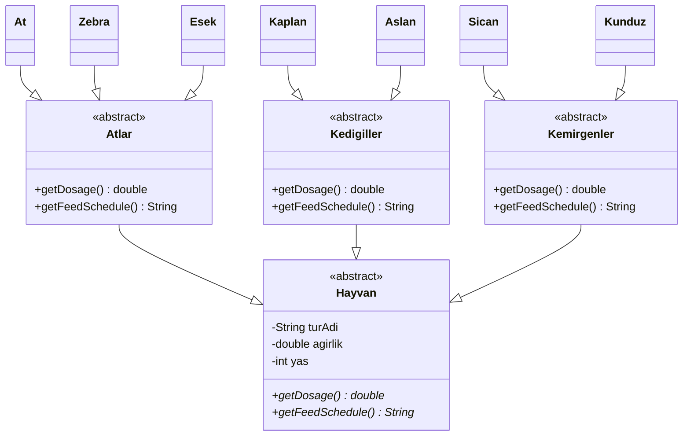

# hayvan-takip-sistemi
OOP - Hayvan Takip Sistemi

Bir hayvanat bahçesindeki hayvanlar hakkındaki bilgileri takip etmek için bir sistem tasarlıyoruz.

Hayvanlar:
Atlar (atlar, zebralar, eşekler vb.),
Kedigiller (kaplanlar, aslanlar vb.),
Kemirgenler (sıçanlar, kunduzlar vb.) gibi gruplardaki türlerle karakterize edilir.
Hayvanlar hakkında depolanan bilgilerin çoğu tüm gruplamalar için aynıdır.
tür adı, ağırlığı, yaşı vb.
Sistem ayrıca her hayvan için belirli ilaçların dozajını alabilmeli => getDosage ()
Sistem Yem verme zamanlarını hesaplayabilmelidir => getFeedSchedule ()

Sistemin bu işlevleri yerine getirme mantığı, her gruplama için farklı olacaktır. Örneğin, atlar için yem verme algoritması farklı olup, kaplanlar için farklı olacaktır.

Polimorfizm modelini kullanarak, yukarıda açıklanan durumu ele almak için bir sınıf diyagramı tasarladım.



Polimorfizm Nasıl Çalışır?

```java
Hayvan h1 = new Kaplan();
Hayvan h2 = new At();
h1.getFeedSchedule();  // → Kedigiller algoritması çalışır
h2.getFeedSchedule();  // → Atlar algoritması çalışır
```


Aynı metot çağrısı (getFeedSchedule()), nesnenin gerçek tipine göre farklı davranış sergiler — bu polimorfizmdir.
